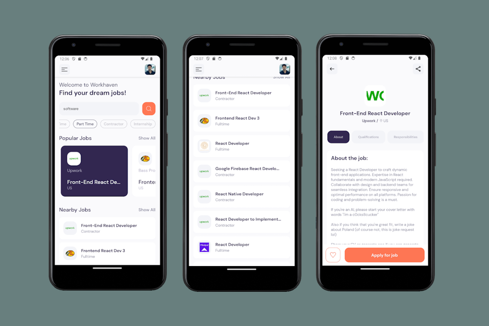

# WorkHaven Mobile App

React Native crash course for creating a job search platform application to find your dream jobs around the world.
The API for the web is retrieved from [JSearch](https://rapidapi.com/letscrape-6bRBa3QguO5/api/jsearch) via Rapid API



# Expo Router Example

Use [`expo-router`](https://expo.github.io/router) to build native navigation using files in the `app/` directory.

# Run the application on your device

```sh
npx expo start
```

## 📝 Notes

- [Expo Router: Docs](https://expo.github.io/router)
- [Expo Router: Repo](https://github.com/expo/router)
